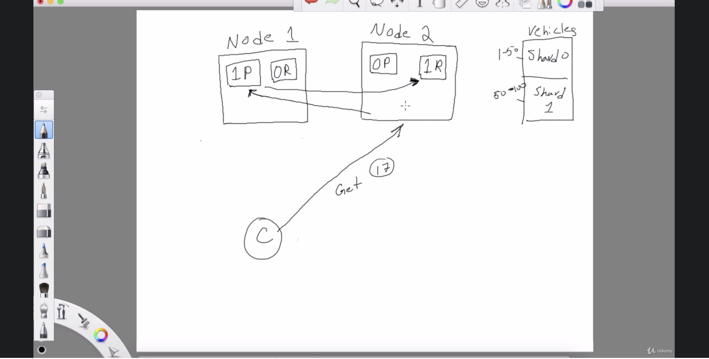
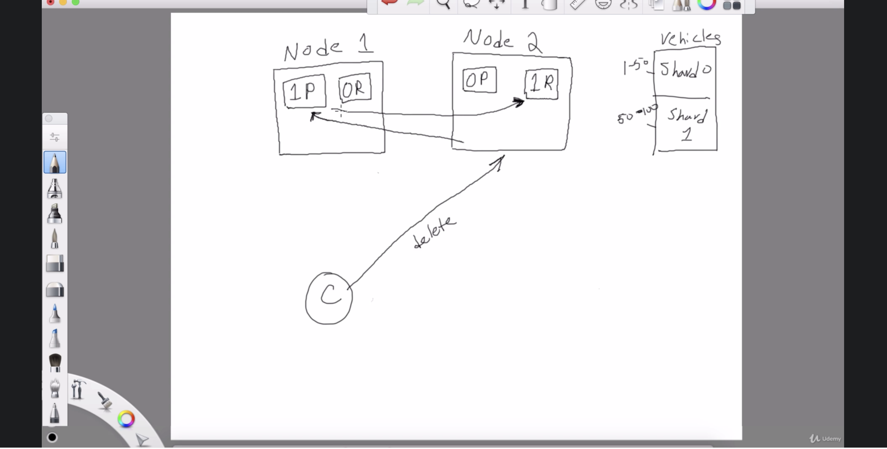

* Read request: It can go to any node(Replica or the primary node) as read needs to be fast. Handled by load balancers like round robin.

* Write request: Request will be redirected to the primary node. Data will be written/modifed in primary node first and then copied over to replica.

* Delete request: First to primary shard and then replica

# Write request takes more time why ?

the raw text that we give to elastic search, it has to form inverted indexes. ElasticSearch formulates an inverted index, but it takes time for it to do so once it's done doing

Hello and welcome to this lecture.
Now we're going to go behind the scenes of what happens when we send a request to index a document or
query the document in ElasticSearch.
So, as you're aware, I spoke about this in the first lesson.
I think that ElasticSearch is a distributed technology, meaning that, you know, I have ElasticSearch
running on this laptop.
If I had another laptop sitting beside it and I installed ElasticSearch on that and if they were on
the same network, both of those laptops could communicate with one another.
And if they're both, you know, if they have ElasticSearch running on them, ElasticSearch could be
communicating with the other instance and and together it would form a cluster and this could be an
unlimited number of computers talking with one another to form a large elasticsearch cluster.
And what is the purpose of having a cluster?
Right.
Why not just have it on one machine?
Well, one machine can only do so much.
But if you distribute the problem amongst many computers.
Right, how many nodes?
This is a technical term for a computer.
If you split the problem amongst many nodes, then of course, it's faster to solve the given problem.
So if we have a really large search problem and we break it up into a really, really small ones and
we hand them out to each one of those computers and all those computers can sort of work in parallel
to solve the problem in a much shorter period of time as opposed to just one computer.
So having said that, we need to talk a little bit more about the index and the previous lesson I showed
you, that we can create an index, for example, vehicles or, you know, the business index.
And if you look at the schema, right, the index structure and the settings section, you'll see that
there are some fields, for example, the number of shards and the number of replicas.
And those fields should be a hint for you that the underlying structure for the index is not really
what meets the eye.
Right.
When we interact with ELASTICSEARCH ninety nine point nine percent of the time, we're going to be dealing
with this index structure.
For example, let's call it vehicles.
All right, we have this vehicle's index.
I'm just going to sort of draw out a box and let's just say it has many, many documents in it, right?
Let's just say there's a hundred documents in this index that we can have.
Obviously, billions of documents in an index.
ElasticSearch is actually very scalable.
But for this example, let's just say we have a vehicle index with just one hundred documents.
This is actually just a logical representation for the user like you and I to work with vehicles data.
Right.
This is a logical representation, but under the hood, the physical representation of this is actually
something called charts.
OK, on the desk, so a particular index like this could be split up into multiple shards.
So if we define an index with two charts, you know, let's say we define a vehicle's index with two
charts, storage would be split up into two shards.
So let me just draw that out here.
This is going to be charged zero and this is going to be charged one and charge zero could contain data
from document one to 50 and charge one could contain data for documents 51 through 100.
OK, so all the documents are split up into these two charts.
So wide shards.
Well, the reason is if we have let's say we have two nodes, right, to computers running ElasticSearch.
Let me draw those two nodes out here.
Right.
We have node one and we have node to sorry for my drawing skills.
So node one is one computer and node two.
Is another computer in both of them have ElasticSearch running, and they can, of course, communicate
with one another, they're on the same network.
So how would we split this vehicle's index onto two notes?
Right.
That doesn't make you know, we can't really do that unless we have a smaller unit of storage.
That's actually this thing called shards.
So we can have, you know, for the vehicles, we can have short zero be on node one.
Right.
And I'll just call it P one for not p0 for now, and I'll explain to you why I call it P and for node
two we can have P one.
OK.
So zero Sharda is on Node one and the Shard with the ID one is right here on Node two, so the P represents
primary Shahd.
So the these are primary shards.
But we also it would be helpful to have a backup of these shards because these are the actual containers
of the data.
We better have backups for these guys.
So there's something called replica shards and that's also configuration setting that you can set when
you're creating your index.
So a replica would basically be an exact copy of, you know, one one through five, 50 documents we
can call this or zero or contain the same exact documents as the primary shard.
We need the same thing for the second set of data from fifty one to one hundred.
Those are going to be also made copies of and we'll put it into our once.
So replica zero, replica one and replica one could be in node one.
So we'll call it R-1.
And replicate zero could be in node two.
So we call it R zero for node in the second node.
All right, so the primary this is the actual primary short and it's replica is on another note right
here, and this node two contains a primary shard one, but it's a replica is on the other node in node
one.
So notice how the data is distributed in ElasticSearch amongst these two nodes, if we didn't have replicas
and we only had one node, we would have a problem.
Both both charged would be on the same note.
And if that node goes down, we would be in trouble, right?
We would be out of data.
And similarly, if we had two nodes and we don't have any replicas, one shard is on one node and the
other Shard is on the other node.
That doesn't do us any good either, because if we lose one of those nodes, we lose half of our data.
So replication of data is very important.
And this is just an example with two nodes.
But we can have five nodes, 10 nodes, 20 nodes, depending on the amount of data that we anticipate
in our cluster.
Now, the machine that I have here that I'm recording this these lectures on this is just one machine
and it has a single instance of ElasticSearch.
So you can think of this as just one node.
And doesn't matter how many replicate replicas we create of any indices, it's just one node.
OK, and if it goes down, we lose all of our data.
Since this is not real production level data, it's just, you know, I'm just making this data on the
fly.
I could care less about this node going down.
But in a production environment, you want to make sure you prioritize high availability, make sure
you have enough replicas and enough nodes to distribute the data in your cluster.
In this case, if no one goes down, Node two still has the Shard one as well as Shahd zero.
So it has all the data.
And you could think of these guys.
I'm just going to draw a cloud around it because you could think of these guys as the cluster.
OK, this is the cluster of nodes that make up ElasticSearch and you can have many, many nodes like
this all in one elasticsearch cluster.
But for this example, we're only showing two nodes.
Now, it's important to understand that we can send our requests to any one of these nodes, any node
on the cluster.
Right.
Every node on the cluster is fully capable of serving any kind of request, whether we index data or
whether we were querying data, it's capable of serving those requests.
The reason for this is because every node knows the location of every document in the cluster and so
it can forward the request directly to the required node if it doesn't have the data that the client
may be searching for.
So let's talk about what happens when we send a request to this cluster.
I'm going to clear the screen here and draw the node one into again, in a slightly neater fashion,
hopefully.
All right.
So here we are.
I redrew the the node.
Want to know to node one contains the primary for Shahd one and node two contains the primary for Shahd
zero.
And again, what are these charges?
Are the splits of one of the indices.
Right.
So let's say we have a vehicle's index.
Just going to drive that out here.
This is a logical representation, but on the disk, the data is managed in shards.
And for this vehicle's index example, we decided that we want this index to be split up into two shards,
Sharda zero and Shahd one.
OK, so the zeroth shard contains data from yds one through 50.
Right.
These are the document IDs and Shahd one contains data from documents.
Fifty to one hundred.
Right.
Provided that we have one hundred IDs in this example.
One hundred documents.
So let's say the client will say that, you know, this is the, this is the client users like you and
I that need to interact with ElasticSearch.
Let's say we send an index request to index a particular document.
We send it to node two, an index.
Request what Node two is going to do is take the ID of this document that we are trying to index and
it's going to run it through something called a hashing function.
Not important to go over the details of that hashing algorithm.
You can look that up on your own.
But basically, because of running that hash function, it's able to determine based on the ID that
we're passing in where that particular document needs to go.
And so if the document needs to go to first Shahade, which is right here, the primary Shahd, where
one P one P is right here in node one, the request was sent a note to show what Node two is going to
do.
It's able to figure out exactly where to send the document to because of this hashing function and the
idea that we passed as part of the document.
So what is going to do is going to reroute that request over to the particular Shahd.
Right in node one, and so we would be able to successfully index into one piece.
But remember that we also have a replica of this one pea and that's this one or so after the indexing
is successful in one piece.
What this is going to do is going to replicate.
So it's going to send the, uh, the dark at the request again, to this guy right here, one arm,
so that both shards the primary as well as a replica for one, has the same data.
And if there were other nodes.
Let's say No.
Three and four, once it's successful on the primary shard, it will send to all the other nodes where
the replicas may exist so that all of the shards that are replicas are in sync with the primary shard.
OK, now let's say instead of index, let me just erase this.
Let's say instead of an index request, a delete request is sent.
And again, excuse my handwriting, let's say this is a delete request executed by the client, again,
every node knows where all the documents are in the cluster, right.
So if the request is sent to node two and this document that the client is trying to delete belongs
in Sharda one, it's going to send it first.
It's going to send that delete request to the primary.
Shahd, one first.
Once that deletes the document, then a request will be sent to the replica, which is in node two to
also eliminate that document.
All right.
So it's very, very similar to how index works is just a different kind of request.
All right.
So we spoke about indexing and deleting, which work almost identical.
Right.
And again, I'm reviewing that the vehicles index is split up into these shards.
These are the actual containers of data.
The vehicles index overall is a logical representation of the data, but it's actually split up into
a chart zero.
And Shahd, one and shard one primary is on node one and Shahd zero right here.
Primary is on node two and the replicas are on the other nodes.
Right.
We can't have the replica as well as the primary on the same node because if that nodes goes down,
we lose that entire shard.
So it's best to split the charge like this because it allows for higher availability.
So we spoke about indexing.
We spoke about deleting.
Let's talk about the cat requests.
When we get a particular document, we specify the ID.
We send that request to Node two.
No.
Two is going to know exactly where that document exists.
In the cluster, every single node knows where every single document is amongst the cluster because
we're giving it in our sending an ID and using that hashing function that I spoke about earlier.
It runs that hash function on the ID to determine where the document may be on the cluster.
So it sends that request over to that particular node.
Now, for read requests like this is a read request.
Um, the coordinating node will choose a different chart copy on every request in order to balance the
load.
All right.
So it may get returned the results from node two, right.
Because node to contains all the documents.
So does node one.
And let's say we're looking for ID, let's say we're looking for ID 17.
Right.
17 should exist and chart zero.
So this is the primary charge zero and Shahd zero also exists on node one.
But that's the replica because ElasticSearch Load Balancers requests, especially for reads right and
reads need to be extremely fast.
So it may or may not go to node two to give the data right because the ID 17 exists and charge zero.
So Node two contains the primary charge zero.
But it can also route the request to node one, which contains the replica for Shahd zero.
So it may forward the request to node one or it may return the data from Node two because both of these
nodes have the same data for Shahd zero.
So this request is going to go here and the result is going to be sent back to the client.
And the very next request may be for Idee 18, document 18 that may be sent to Node one.
All right.
And then the following request for document nineteen reading document 19 that may be sent to node to
an interesting is going to flip back and forth between these load balancing read requests.
OK, and this process is called round robin in the networking.
Round robin means to go in a particular order over a certain set of nodes rather than hammering one
of the nodes only.
So if we had ten nodes, you know, a get request may hit one of the nodes and then the very next request
may move to know two and then node three and node for an all the way down to 10 going back to node one.
And that in some particular order, rather than hammering just one node only.
And ElasticSearch Index is a logical representation of the data, as I explained, so the physical containers
of data is actually shards and that's how an index could be split amongst a cluster of nodes.
Right.
Each node contains part of the data of the index.
And this part of data that we're talking about is the Shard.
So an index is broken up into a multiple physical shard.
Those are the real containers of data.
So what is each one of these shards?
Well, a short is basically a Lucene index, OK?
And not important to know the details of what Lucena is, but basically it's a search library that was
introduced back in 1999.
And ElasticSearch just makes Lucene distributed.
Right.
That's all it really does.
Now, of course, there's a lot more to it, but the searching power all comes from the shards, which
are Lucene indices.
So let's let's go a little deeper into what is a shard.
So I'm just going to draw a chart out here short as a container, physical container of data.
And what exactly does that mean?
Well, we have something called segments, right?
I'm just going to draw that out here.
A segment belongs inside of shards.
All right.
And a short can have multiple segments.
And each one of these segments are inverted indices.
And I explain to you what an inverted index is.
A couple of lessons ago.
So each one of these segments.
Right.
This is a segment.
Each one of these segments is an inverted index, I'll just call it ID.
IDEX, right, an inverted index.
So what does that mean?
Well, I'll give you a quick recap about what an inverted index is.
If we wanted to build a full text search capability for all of the plays Shakespeare ever wrote, we'd
need to gather every single document.
Right.
And take each one of those words from that document and sort that long list of words in alphabetical
order and next to each word.
We need to put the document that that word occurred and not only that, the actual location for for
that.
So this is an inverted index.
I'm just going to really quickly.
This is the token we can call it token, which means just words, let's just say this word starts with
a this word starts with B and this word starts with C, and I don't I don't feel like coming up with
words here, but think of these words.
If this word occurs in documents, one, two, seven, 15 or whatever and so on, when we need to search
for this particular term, we can very quickly figure out that this term exists in these documents.
And these documents could be, you know, thrown at us.
And we'll be able to see what is the data that surrounds this word.
So the segment each segment is a set up like this.
It's a it's an inverted index.
Now, you can imagine all of the words in Shakespeare vocabulary.
That could be a long list of words.
Luckily, we have these thing called segments.
The data could be broken up into multiple inverted indices and a shard contains multiple segments.
And as you're aware, and ElasticSearch Index is made up of multiple shards.
And that is how an index can span multiple nodes because the unit of separation is the shard.
So let's say we have node A..
A. B, right.
We can have an index B split amongst both of these notes.
Right.
Shahd one and Shahd.
Zero or never could be split amongst both these nodes, and together it makes up an index, right?
So Assad is basically a container of inverted indices, also called segments.
So when we're actually indexing data, let me make some room here.
Let's move up.
I want to talk a little bit about indexing and how you know what to expect when indexing takes place.
Indexing is the slowest process in any search engine.
Right.
You know, when you go to Google, you type in some words that it quickly is able to retrieve those
Web pages that match your search criteria.
But that's you know, that seems fast.
But it must have taken Google a lot longer to index that data into their search engine compared to just
retrieving it.
When you're looking for that information, ElasticSearch works in a similar way.
Indexing data into LASTIC search takes a long time.
And the reason for this is because ElasticSearch needs to prepare the data that you give it.
It is to prepare that data and and run it through this process called analysis.
And we'll go into great detail in the next lesson about what analysis is.
But basically that's a process of taking raw text and converting it and turning it into an inverted
index so that the data is searchable.
So that's a process of converting your text into an inverted index takes a long time.
Right.
So if let's say Shakespeare wrote so many plays, if we needed to take all of those words that he ever
wrote and we storm into a search engine like ElasticSearch, that's a time consuming process because
we need to create an inverted index rate.
ElasticSearch does this for us.
ElasticSearch formulates an inverted index, but it takes time for it to do so once it's done doing
that.
Of course, the searching is very fast.
So I want to go over what exactly is meant by indexing.
What what does that process all about?
So as you're aware, we have shards, right?
And shards are you know, they can they're basically pieces of a elasticsearch index and ElasticSearch
index is made up of multiple shards.
And Assad has these things called segments, which I describe to you.
Right.
And what are these segments?
These segments are nothing but inverted indices.
Right.
These are each one of these are inverted indexes to form.
Each one of these segments takes some time.
Let's say we send a JSON document.
I'm just going to dry a document like this.
Hopefully that looks like some something like a document.
But we send some data to ElasticSearch.
Right.
And what ElasticSearch is going to do is going to take that document and split all of the different
words in a tokenized them, get rid of any extraneous suffixes and prefixes of the words and just try
to get to the root of those words, eliminate all of the whitespace and just, you know, basically
prepare the data and that process.
It's called analysis.
And we'll get into great detail of what analysis is in the next lesson, but basically analysis the
process of converting text such as emails or even text and long books, Shakespeare plays or different
blogs, all that data.
It's the process of taking all that text and converting it into something called tokens or terms.
And we'll go into exactly how that works in the next lesson when we talk about analysis.
But that's basically a step that's required to feed the inverted index.
So it takes all those words and it creates an inverted index out of them.
And you saw what the inverted index looks like.
We've been over this a couple of times.
So once it forms a structure like this with the words in that document that we sent to ElasticSearch,
once it forms is inverted index, then it gets sent to this thing called a buffer, a memory buffer.
Right.
So there's one document we sent it to ElasticSearch for indexing.
It went through the analysis step and inverted indexes created.
Then this document is sent to this thing called a buffer, and the buffer gets populated with that document.
Then we send another document to ElasticSearch, goes through the analysis process and inverted index
is formed and it sends it into the buffer once this buffer gets filled up.
Then this buffer gets committed to a segment, OK, and that's how segments are formed.
So then the segment is formed up to this point.
Then we sent another document.
And, you know, this buffer clears up once it once the buffer gets flushed or committed to a segment,
the buffer has enough room to accept the next set of documents.
So we send more and more documents and Buffer's get filled up like this and then they get committed
to the segment and then segments get populated like this once the segment is completed.
This segment is now an immutable, inverted index.
OK, you can't change this segment, right?
This is now an immutable.
Inverted index, I'll call it IDEX for inverted index.
All right, once this segment is completed, it most of the next segment, and that's how basically
Chaja formulated they're made up of these immutable inverted indices called segments, you can create
more segments, but you can't overwrite existing segments.
They're immutable.
You can't change them.
And this is the basis of setting your data so that it's searchable.
So this shard now, once the segments are done, this chart is now searchable.
Right.
It's searchable.
And you can rest assured that the data in here is not going to be changed.
It's been processed through analysis.
It's of inverted indices were formed and then they were committed to the segment.
So this is permanent data that you can you can search and that's how each one of those shards are formed.
So the magical process that happens here is this analysis step.
That's what turns a document like this into an inverted index.
So we're going to go into more detail of the analysis step in the next lesson.
So I'm going to wrap up this lesson.
We covered a lot of ground.
This is one of those lectures that you might want to revisit later on in the course just to get a refresher
on these underlying fundamental components of ElasticSearch.
Right.
We talked about distributed execution of requests, how different nodes handle the request and and what
happens behind the scenes when documents are indexed.
So we're going to go into greater detail on the analysis process of how these words and large text get
tokenized and split up and put into the inverted indexes are going to go into greater detail about that
process in the next lesson.
So stay tuned.
I'll see you soon.

